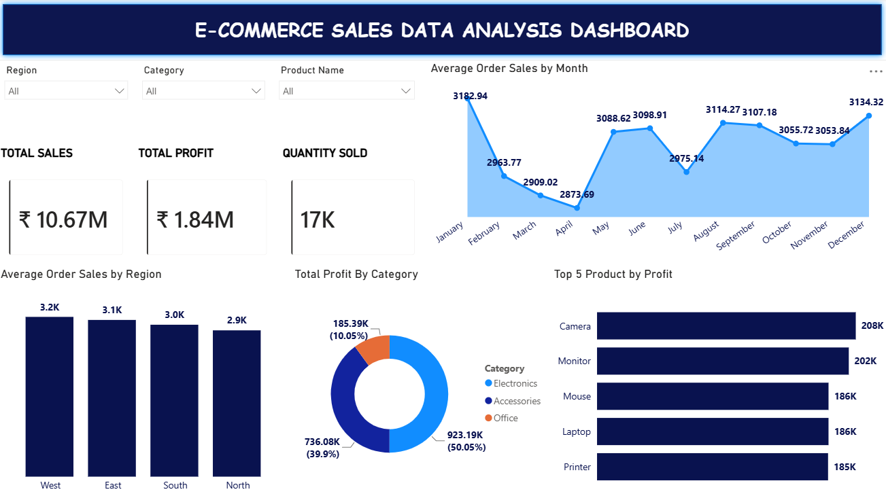
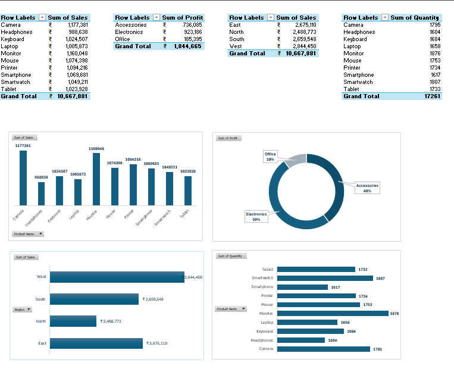

# E-commerce Sales Analysis Dashboard

An interactive Excel dashboard analyzing e-commerce sales performance using Pivot Tables, Pivot Charts, and Slicers.

---

## 📌 Project Overview

This project explores e-commerce sales data to answer key business questions:
- Which products and categories generate the most sales and profit?
- How does sales performance vary across regions?
- What's the average order value across products and regions?
- Which products sell the highest quantity?

---

## 📊 Dataset

- **Source:** [Add Kaggle/source link here]
- **Size:** 3,500 order records
- **Columns:** Order Date, Product Name, Category, Region, Quantity, Sales, Profit

---

## 🛠️ Tools & Skills Used

- **Excel** — data analysis and dashboard design
- **Pivot Tables** — aggregating sales, profit, and quantity by product, category, and region
- **Pivot Charts** — visualizing trends and comparisons
- **Slicers** — interactive filtering by Region, Category, and Product Name

---

## 📈 Dashboard Contents

- **KPI Cards:** Total Sales, Total Profit, Quantity Sold
- **Average Order Sales by Month** — trend across the year
- **Average Order Sales by Region** — East, West, North, South comparison
- **Total Profit by Category** — Electronics, Accessories, Office
- **Top Products by Profit** — Camera, Monitor, Mouse, Laptop, Printer
- **Slicers:** Region, Category, Product Name — for interactive filtering

---

## 💡 Key Insights

- Total Sales: ₹10.67M | Total Profit: ₹1.84M | Quantity Sold: 17K
- Electronics is the top-performing category, contributing ~50% of total sales
- West region shows the highest average order value

---

## 📷 Screenshots

|[Excel Dashboard](E-Commerce_Sales_Dashbaord_Excel.png)

---

## 🙋 About Me

Learning Data Analytics through hands-on projects. Currently building my portfolio in Excel and Power BI, and actively looking for entry-level opportunities in Data Analytics / Business Intelligence.

**Connect with me:** [https://www.linkedin.com/in/nasrath-banu-a-016b952b4]
