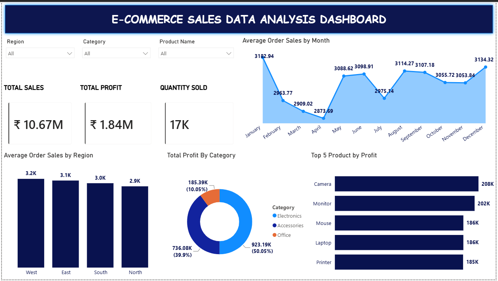
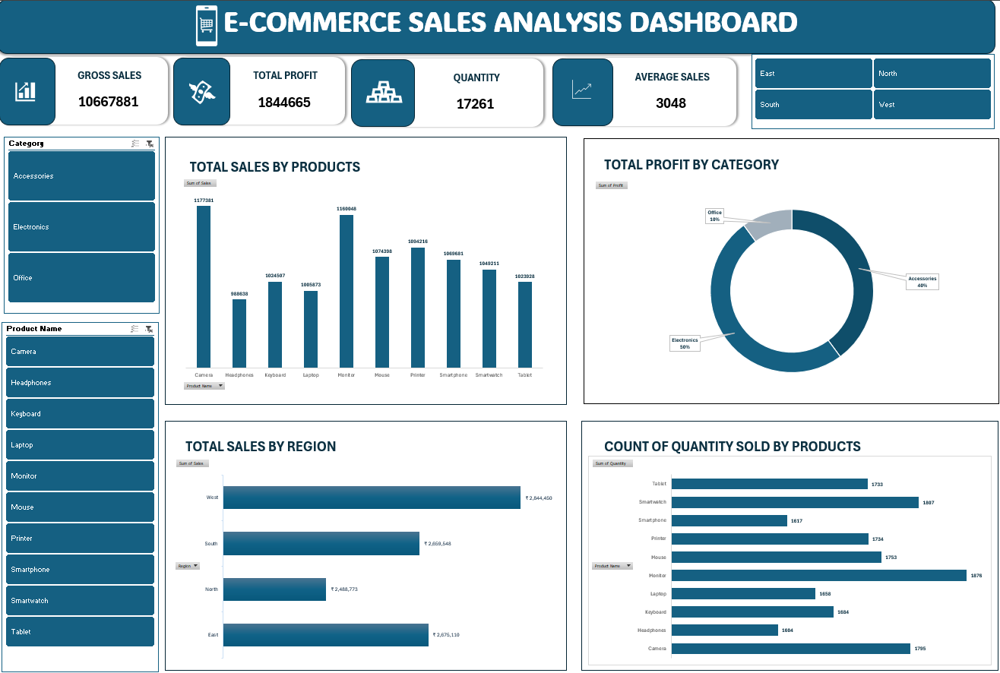
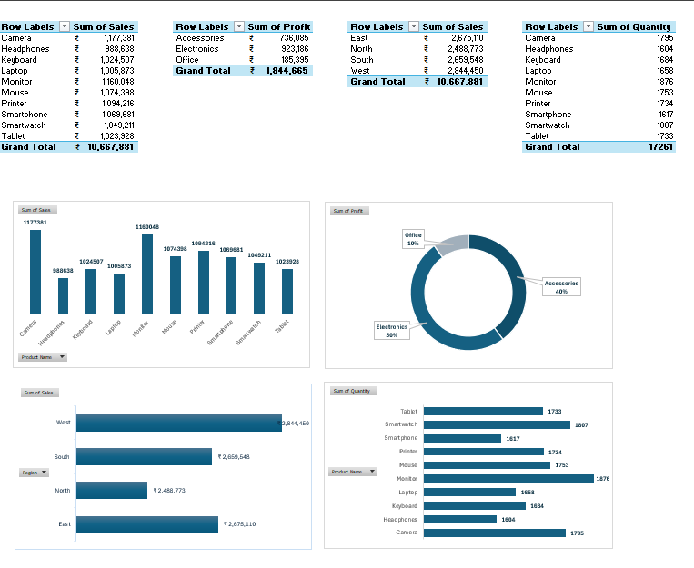

# E-commerce Sales Analysis Dashboard

**Power BI | Excel (Pivot Tables, Pivot Charts, Slicers) | 3,500 orders**

An end-to-end sales and profit analysis of 3,500 e-commerce orders, delivered as two interactive dashboards (Power BI and Excel) that show which products, categories and regions drive revenue and profit.

---

## 📌 Executive Summary

Analyzed **₹10.67M in sales, ₹1.84M in profit and 17,261 units sold** across 10 products, 3 categories and 4 regions. Headline findings:

- **17.3% overall profit margin.**
- **Electronics and Accessories generate ~90% of profit** (50.05% and 39.90%); Office contributes only 10.05%.
- **Sales are evenly spread:** every product contributes between 9.3% and 11.0% of revenue, so there is no single-product dependency.
- **West is the strongest region** (₹2.84M, 26.7% of sales), about 14% ahead of North.
- **Average order value holds steady** at ₹3,048, with no strong seasonality.

---

## 🎯 Business Problem

A retailer needs to know where revenue and profit actually come from before deciding what to stock, promote and fix:

1. Which products and categories generate the most sales and profit?
2. How does performance vary across regions?
3. What is the average order value, and does it change through the year?
4. Which products sell the highest quantity?

---

## 📊 Dataset

- **Source:** [Kaggle - E-commerce Data Analyst](https://www.kaggle.com/datasets/aliiihussain/e-commerce-data-analyst)
- **Size:** 3,500 order records x 7 columns
- **Columns:** Order Date, Product Name, Category, Region, Quantity, Sales, Profit
- **Data quality:** The dataset was analysis-ready, so no cleaning was required. Totals were reconciled across the pivot tables, the Excel dashboard and the Power BI dashboard (Sales ₹10,667,881 | Profit ₹1,844,665 | Quantity 17,261).
- **Note:** Average selling price is almost identical across products (about ₹580-₹660 per unit, including laptops and mice), which indicates a synthetic practice dataset. The project demonstrates the analysis workflow rather than a real retailer's pricing.

---

## 🛠️ Tools & Pipeline

| Stage | What was done |
|---|---|
| **Excel - analysis** | Built Pivot Tables (sales by product, profit by category, sales by region, quantity by product) and Pivot Charts |
| **Excel - dashboard** | Designed an interactive dashboard with KPI cards and slicers for Category, Product Name and Region |
| **Power BI - dashboard** | Rebuilt the analysis as a Power BI report with KPI cards, a monthly trend, regional comparison and dropdown slicers (Region, Category, Product Name) |
| **Validation** | Reconciled KPI totals across all three views |

**Metric definitions**
- Profit margin = Total Profit / Total Sales = 17.3%
- Average order value = Total Sales / 3,500 orders = ₹3,048

---

## 📈 Dashboards

### Power BI version
- KPI cards: Total Sales, Total Profit, Quantity Sold
- Average Order Sales by Month (trend)
- Average Order Sales by Region
- Total Profit by Category
- Top 5 Products by Profit

### Excel version
- KPI cards: Gross Sales, Total Profit, Quantity, Average Sales
- Total Sales by Product, Total Profit by Category, Total Sales by Region
- Quantity Sold by Product
- Slicers: Category, Product Name, Region

### Pivot tables behind the dashboards

---

## 💡 Key Insights

1. **Healthy 17.3% margin.** ₹10,667,881 in sales produced ₹1,844,665 in profit across 17,261 units, with an average order value of ₹3,048 (about 4.9 units per order).
2. **Profit is concentrated in two categories.** Electronics earns ₹923,186 (50.05%), Accessories ₹736,085 (39.90%) and Office only ₹185,395 (10.05%).
3. **Revenue is evenly distributed across products.** All 10 products sit between ₹0.99M and ₹1.18M. Camera leads (₹1,177,381, 11.0%), followed by Monitor (₹1,160,048, 10.9%); Headphones is lowest (₹988,638, 9.3%).
4. **Volume leaders differ from revenue leaders.** Monitor sells the most units (1,876), then Smartwatch (1,807) and Camera (1,795). Headphones is last in both units (1,604) and sales.
5. **West leads, North lags.** West generated ₹2,844,450 (26.7% of sales), ahead of East (₹2,675,110), South (₹2,659,548) and North (₹2,488,773, 23.3%). West is about 14% above North.
6. **Order value is stable all year.** Average order value ranges from ₹2.87K (April) to ₹3.18K (January), so there is no strong seasonal swing.
7. **Profit per product is tightly clustered.** The top 5 products by profit earn ₹185K-₹208K each: Camera, Monitor, Mouse, Laptop and Printer.

---

## ✅ Recommendations

1. **Protect the profit engine.** Electronics and Accessories deliver ~90% of profit, so prioritize stock availability and marketing spend there. Review Office pricing and costs, or bundle Office items with Electronics purchases to lift its 10% share.
2. **Fix the weakest product.** Headphones trails every other product in both sales and units. Test bundling with high-selling items such as Smartphones, or run targeted promotions before deciding whether to keep it in the range.
3. **Close the North gap.** North sits ~14% below West. Investigate pricing, marketing and delivery in North, and replicate what works in West.
4. **Grow order value, not seasonal campaigns.** With flat monthly order value, upselling and bundles are likely to raise revenue more reliably than seasonal promotions.

---

## 📁 Project Files

| File | Description |
|---|---|
| `.xlsx` workbook | Dataset, pivot tables, pivot charts and Excel dashboard |
| `images/` | Power BI dashboard, Excel dashboard and pivot table screenshots |
| `README.md` | Project documentation |
| `.pbix` | Power BI Dashboard |

---

## 🙋 Work With Me

I build **Power BI dashboards, Excel reporting and data cleaning pipelines** that turn raw data into decisions. Open to freelance projects and full-time roles.

- Dashboard design and DAX modeling (Power BI)
- Excel analysis, pivot reporting and automation
- Data cleaning and analysis with Python and SQL

**Contact:** `nasrathbanu30@gmail.com` | `<Upwork / Fiverr profile link>` | [LinkedIn](https://www.linkedin.com/in/nasrath-banu-a-016b952b4)
